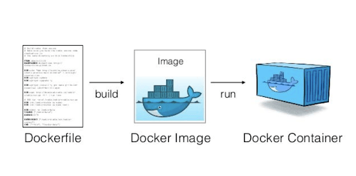
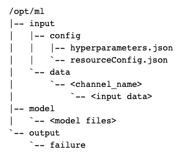

# Deployment Dockerized ML Models in AWS Sagemaker

## Table of contents

* [Docker](#Docker)
* [ML Docker Structure for Sagemaker](#ML-Docker-Structure-for-Sagemaker)
* [Execution Stack for Container](#Execution-Stack-for-Container)
* [WSGI (Web Server Gateway Interface)](#WSGI (Web Server Gateway Interface))
* [Main Components](#Main-Components)
* [Container Application](#Container-Application)

## Docker

Docker provides a simple way to package arbitrary code into an image that is totally self-contained. Once you have an image, you can use Docker to run a container based on that image. Running a container is just like running a program on the machine except that the container creates a fully self-contained environment for the program to run. Containers are isolated from each other and from the host environment, so the way you set up your program is the way it runs, no matter where you run it.

Docker is more powerful than environment managers like conda or virtualenv because (a) it is completely language independent and (b) it comprises your whole operating environment, including startup commands, environment variable, etc.

In some ways, a Docker container is like a virtual machine, but it is much lighter weight. For example, a program running in a container can start in less than a second and many containers can run on the same physical machine or virtual machine instance.

Docker uses a simple file called a Dockerfile to specify how the image is assembled. We'll see an example of that below. You can build your Docker images based on Docker images built by yourself or others, which can simplify things quite a bit.

## ML Docker Structure for Sagemaker

### input
* /opt/ml/input/config contains information to control how your program runs. hyperparameters.json is a JSON-formatted dictionary of hyperparameter names to values. These values will always be strings, so you may need to convert them. resourceConfig.json is a JSON-formatted file that describes the network layout used for distributed training. Since scikit-learn doesn't support distributed training, we'll ignore it here.
* /opt/ml/input/data/<channel_name>/ (for File mode) contains the input data for that channel. The channels are created based on the call to CreateTrainingJob but it's generally important that channels match what the algorithm expects. The files for each channel will be copied from S3 to this directory, preserving the tree structure indicated by the S3 key structure.

### output
* /opt/ml/model/ is the directory where you write the model that your algorithm generates. Your model can be in any format that you want. It can be a single file or a whole directory tree. SageMaker will package any files in this directory into a compressed tar archive file. This file will be available at the S3 location returned in the DescribeTrainingJob result.
* /opt/ml/output is a directory where the algorithm can write a file failure that describes why the job failed. The contents of this file will be returned in the FailureReason field of the DescribeTrainingJob result. For jobs that succeed, there is no reason to write this file as it will be ignored.

## Execution Stack for Container

  

* /ping will receive GET requests from the infrastructure. Your program returns 200 if the container is up and accepting requests.
* /invocations is the endpoint that receives client inference POST requests. The format of the request and the response is up to the algorithm. If the client supplied ContentType and Accept headers, these will be passed in as well.

## WSGI (Web Server Gateway Interface)

WSGI has two parts:

The server–often high-profile web servers such as Nginx or Apache
The web app made from a python script
The server executes the web app and sends related information and a callback function to the app. The request is processed on the app side, and a response is sent back to the server utilizing the callback function.

Sometimes there might be one or more WSGI middlewares between the server and the web app. Middleware is used to direct requests to various app objects, load balancing, content preprocessing and running several frameworks or apps alongside each other in the same process. Examples of Python frameworks that support WSGI include Django, CherryPy, Flask, TurboGears, and web2py.

  

The main principle for using wsgi with flask app can be displayed on this pic:

  

## Main Components

* Dockerfile: The Dockerfile describes how the image is built and what it contains. It is a recipe for your container and gives you tremendous flexibility to construct almost any execution environment you can imagine. Here. we use the Dockerfile to describe a pretty standard python science stack and the simple scripts that we're going to add to it. See the Dockerfile reference for what's possible here.

* docker_to_ecr.sh: The script to build the Docker image (using the Dockerfile above) and push it to the Amazon EC2 Container Registry (ECR) so that it can be deployed to SageMaker. Specify the name of the image as the argument to this script. The script will generate a full name for the repository in your account and your configured AWS region. If this ECR repository doesn't exist, the script will create it.

* sagemaker-estimator: The directory that contains the application to run in the container. See the next session for details about each of the files.

## Container Application

* train: The main program for training the model. When you build your own algorithm, you'll edit this to include your training code.
* serve: The wrapper that starts the inference server. In most cases, you can use this file as-is.
* wsgi.py: The start up shell for the individual server workers. This only needs to be changed if you changed where predictor.py is located or is named.
* predictor.py: The algorithm-specific inference server. This is the file that you modify with your own algorithm's code.
* nginx.conf: The configuration for the nginx master server that manages the multiple workers.

